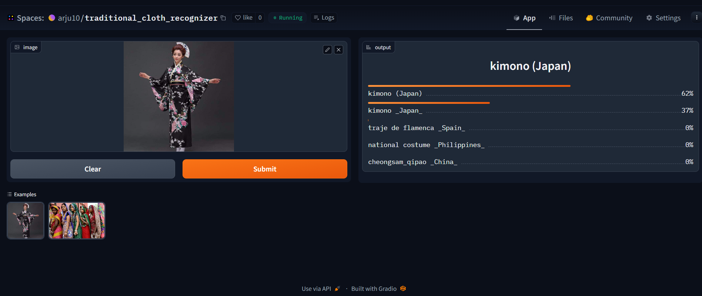

#  Traditional Cloth Recognizer
An image classification model from data collection, cleaning, model training, deployment and API integration.  
The model can classify 23 different types of Traditional Cloth  
The types are following:  

# 1. Interesting Topic Selection with 9+ categories (done)
## Topic: Traditional Cloth Recognizer
### Categories: (23)
1. KIMONO (JAPAN)
2. HANBOK (SOUTH KOREA)
3. CHEONGSAM/QIPAO (CHINA)
4. SARI (INDIA)
5. THAWB/DISHDASHA (SAUDI ARABIA)
6. DIRNDL (GERMANY)
7. KILT (SCOTLAND)
8. AO DAI (VIETNAM)
9. BOUBOU (WEST AFRICA)
10. HUIPIL (MEXICO)
11. SARONG (INDONESIA)
12. CHADOR (IRAN)
13. TRAJE DE FLAMENCA (SPAIN)
14. BATIK (MALAYSIA)
15. THOBE (PALESTINE)
16. NATIONAL DRESS (NORWAY)
17. NATIONAL COSTUME (PHILIPPINES)
18. BARONG TAGALOG (PHILIPPINES)
19. ABAYA (UNITED ARAB EMIRATES)
20. FOLKDRÄKT (SWEDEN)
21. AO PO'I (PARAGUAY)
22. POUNAMU PIUPIU (NEW ZEALAND)
23. KAFTAN (MOROCCO)

# 2. Data Collection, Model Training, Data Cleaning (done)
**Data Collection:** Downloaded from DuckDuckGo using term name  
**DataLoader:** Used fastai DataBlock API to set up the DataLoader.  
**Data Augmentation:** fastai provides default data augmentation which operates in GPU.  

# Training and Data Cleaning
**Training:** Fine-tuned a resnet34, resnet152, DenseNet121 model for 6 epochs (3 times) and got upto ~83% accuracy. Among the model resnet152 is performed good compare to others which is about 83%  
**Data Cleaning:** This part took the highest time. Since I collected data from browser, there were many noises. Also, there were images that contained. I cleaned and updated data using fastai ImageClassifierCleaner. I cleaned the data each time after training or fine-tuning, except for the last time which was the final iteration of the model.  

# 3. Deploy Model with Gradio & HuggingFace Spaces (done)
I deployed to model to HuggingFace Spaces Gradio App. The implementation can be found in `deployment` folder or [here](https://arju10-traditional-cloth-recognizer.hf.space).
 ### Gradio App URL: [here](https://897f24d5bf9ba00855.gradio.live )
       

# 4. Build a GitHub Pages Website and integrate API (done)
The deployed model API is integrated [here](https://arju10.github.io/tradiotional-cloth-recognizer/) in GitHub Pages Website. Implementation and other details can be found in `docs` folder.

# 5. Setting Up the project in GitHub  (done)
> https://github.com/arju10/traditional-cloth-recognizer.git
